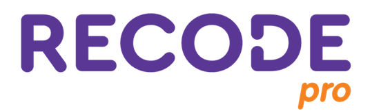

 

      

  <a href ="#rocket-o-projeto">Projeto</a>  •
  <a href ="#dart-proposta">Proposta</a>  •
  <a href ="#hourglass_flowing_sand-planejamento-de-entregas">Planejamento</a>  •
  <a href ="#calendar-os-sprints">Sprints</a>  •
  <a href ="#camera_flash-as-versões">Versões do site</a>  •
  <a href ="#computer-tecnologias-utilizadas">Tecnologias</a>  •
  <a href ="#bulb-metodologia-utilizada">Metodologia</a>  •
  <a href ="#bar_chart-backlog-do-projeto">Backlog</a>  •
  <a href ="#mortar_board-equipe">Equipe</a>

<h1 align="center">
  Projeto desenvolvido no ano de 2022 entre 16 de maio à 15 novembro pelos estudantes do Squad 56 da Recode Pro 2022.
<h1 align="center">
 
      
## :rocket: O Projeto

* A ideia para a plataforma surgiu a partir de um problema: a baixa proficiência em leitura (desafio 5). Uma das formas encontradas para intervir, e ajudar no desenvolvimento de crianças mais profecientes é melhorar a leitura através de textos focados em gêneros literários
fáceis e atrativos.

 

## :dart: Proposta
**Desenvolver uma plataforma que desenvolva as crianças na leitura através de textos alinhados com os usados no Programa Internacional de Avaliação de Estudantes (Pisa).**

 

## :camera_flash: Apresentação Final do Projeto

**Clique no link abaixo para visualizar o vídeo final do projeto:**  
> :movie_camera: [Vídeo Final](https://www.youtube.com/  )

 
      
**:link: Clique no link abaixo para visualizar o site hospedado:**
>  [http://Douto](https://meu site.herokuapp.com/)
      
Nota 1:  Devido a hospedagem ser viabilizada de forma gratuita, o tempo de requisição de algumas funcionalidades podem ter maior tempo de resposta, todavia as principais funcionalidades, estão disponíveis para verificação.

 

## :hourglass_flowing_sand: Planejamento de Entregas
      
- [x] [SPRINT 1] - 13/06/2022 a 18/06/2022
- [x] [SPRINT 2] - 23/07/2022 a 03/10/2022
- [x] [SPRINT 3] - 04/10/2022 a 15/10/2022  
  

   

## :calendar: Os Sprints

☑️ SPRINT 1 ([Link da Pasta](https://github.com/Squad56/Douto/tree/main/SPRINT_01)): Concluído :heavy_check_mark:

☑️ SPRINT 2 ([Link da Pasta](https://github.com/Squad56/Douto/tree/main/SPRINT_02)): Concluído :heavy_check_mark:

☑️ SPRINT 3 ([Link da Pasta](https://github.com/Squad56/Douto/tree/main/SPRINT_03)): Concluído :heavy_check_mark:
      
  

## :camera_flash: As Versões

☑️ 1 ENTRGA ([(https://squad562.github.io/siteprimeiraentrega/)]):heavy_check_mark:

☑️ 2 ENTRGA ([(https://squad562.github.io/siteprimeiraentrega/)](https://squad561.github.io/sitesegundaentrega/)):heavy_check_mark:

  

## :computer: Tecnologias Utilizadas

            

 

* **Banco de Dados:** SQL
* **Back-end:** Java, Tunderclient, Node, Apache TomCat                   
* **Front-end:** HTML, CSS, Bootstrap, ReactJS e JavaScript              
* **Ferramentas:** Visual Studio Code, SpringToolSuite4, MySQL, BrModelo e Eclipse
* **Design:** Illustrator, Photoshop, Corel Draw
* **Planejamento:** Planner, Project Libre, PowerPlataform
* **Comunicação:** Discord, Whatsapp, Teams

 

## :bulb: Metodologia Utilizada

* **Metodologia Ágil:** Framework [Scrum](https://www.desenvolvimentoagil.com.br/scrum/)

       
      
## :bar_chart: Backlog do Projeto

 

      

      
   
      
## :mortar_board: Equipe 

|Nome|Função|Linkedin|GitHub|Avatar|
| -------- |-------- |-------- |-------- |-------- |
|**Danny Berrios**|Scrum Master Desenvolvedor|[@LinkedIn](https://www.linkedin.com/in/danny-berrios/)|[@GitHub](https://github.com/dennyberrios)||
|**Ewerton Rubi**|Desenvolvedor| [@LinkedIn](http://linkedin.com/in/ewerton-rubi/)|[@GitHub](https://github.com/EwertonRAMonteiro)||
|**Eduardo Junior**|Desenvolvedor| [@LinkedIn](https://www.linkedin.com/in/eduardo-junior-71049236/)|[@GitHub](https://github.com/eduardojr17)||
|**Jhenyffer Silva**|Desenvolvedora| [@LinkedIn](http://linkedin.com/in/jhenyffer-silva-574297182)|[@GitHub](https://github.com/Jhenyffer368Silva)||
|**Renato Wessner**|Desenvolvedor| [@LinkedIn](http://linkedin.com/in/renato-wessner)|[@GitHub](https://github.com/renato-wessmer)||
|**Tarcio Azevedo**|Desenvolvedor| [@LinkedIn](http://linkedin.com/in/tarcioazevedo)|[@GitHub](https://github.com/TarcioAzevedo)||      
      
 

<h1 align="center"> </h1>    
 
